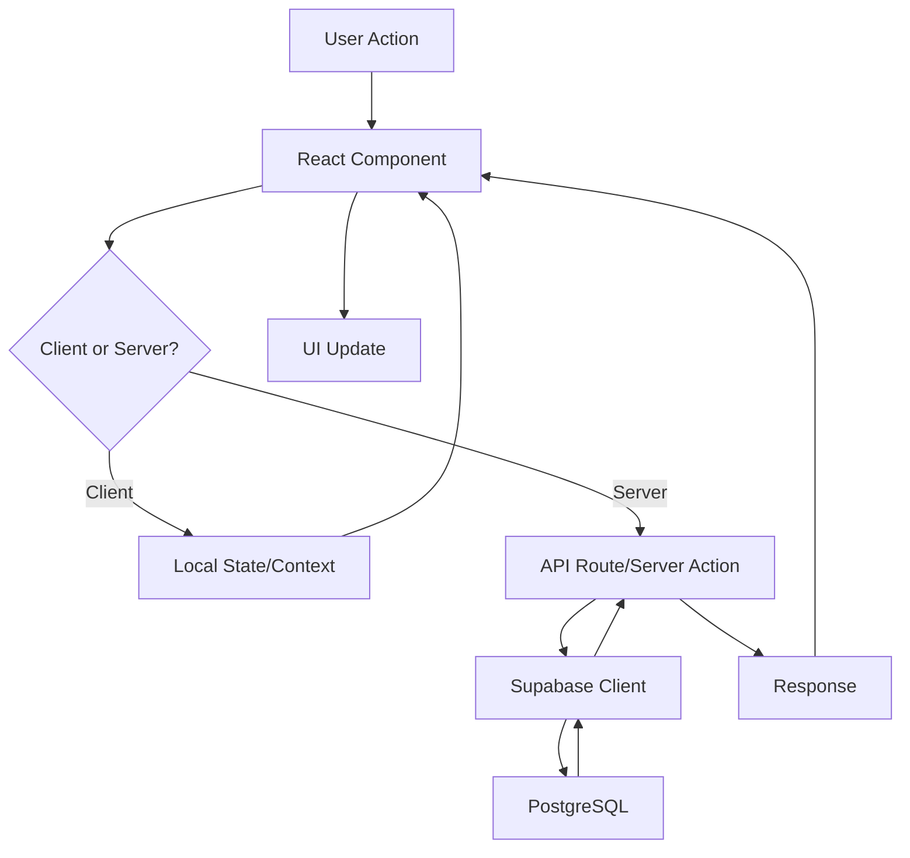
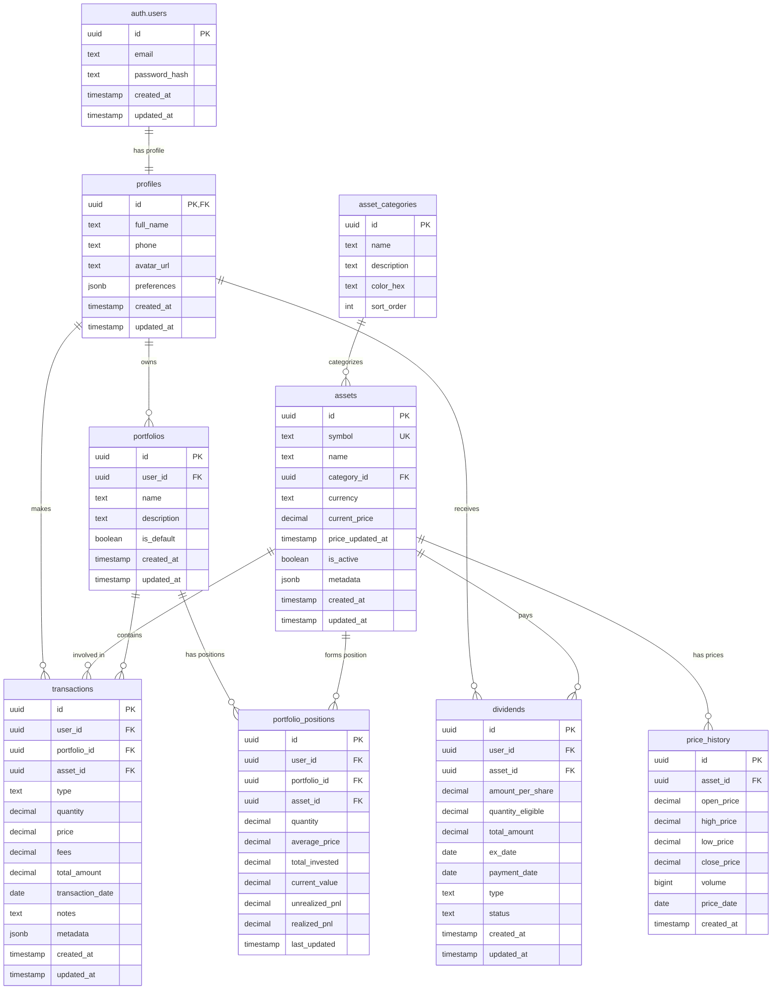

# PRD - Controle de Investimentos

## Product Requirements Document

> **🏛️ DOCUMENTO MASTER - FONTE ÚNICA DA VERDADE**  
> Este é o documento oficial que guia todo desenvolvimento do projeto.  
> Consulte sempre antes de implementar novas funcionalidades.

**Versão:** 1.2  
**Data:** 23 de Setembro, 2025  
**Projeto:** PulodoGato Investments  
**Tipo:** Progressive Web App (PWA)  
**Status:** ✅ Ativo e Aprovado

### 📋 Controle de Versões

| Versão | Data       | Mudanças                                         | Aprovado por |
| ------ | ---------- | ------------------------------------------------ | ------------ |
| 1.0    | 23/09/2025 | Versão inicial completa                          | Equipe Dev   |
| 1.1    | 23/09/2025 | Perfil avançado + Sistema de conexões            | Equipe Dev   |
| 1.2    | 23/09/2025 | Finanças Pessoais + Sistema de divisão de gastos | Equipe Dev   |

> **⚠️ Para mudanças nesta PRD:** Consulte `/docs/PRD-Governance.md`

---

## 📋 Índice

1. [Visão Geral do Produto](#visão-geral-do-produto)
2. [Objetivos de Negócio](#objetivos-de-negócio)
3. [Personas e Casos de Uso](#personas-e-casos-de-uso)
4. [Funcionalidades](#funcionalidades)
5. [Regras de Negócio](#regras-de-negócio)
6. [Arquitetura Técnica](#arquitetura-técnica)
7. [Estrutura do Banco de Dados](#estrutura-do-banco-de-dados)
8. [Interface do Usuário](#interface-do-usuário)
9. [Segurança e Compliance](#segurança-e-compliance)
10. [Performance e Escalabilidade](#performance-e-escalabilidade)
11. [Roadmap](#roadmap)

---

## 🎯 Visão Geral do Produto

### Problema

Investidores pessoa física enfrentam dificuldades para:

- Acompanhar performance consolidada de múltiplos investimentos
- Calcular preço médio de ativos com precisão
- Controlar recebimento de dividendos e proventos
- Visualizar alocação de carteira de forma clara
- Ter acesso móvel aos dados de investimentos

### Solução

Uma Progressive Web App que centraliza o controle de investimentos, oferecendo:

- Dashboard consolidado com métricas em tempo real
- Cálculo automático de preço médio e rentabilidade
- Controle de dividendos e proventos
- Gráficos interativos de performance e alocação
- Acesso offline via PWA

### Proposta de Valor

- **Simplicidade**: Interface intuitiva para usuários não-técnicos
- **Mobilidade**: Funciona offline e pode ser instalado como app
- **Precisão**: Cálculos automáticos e confiáveis
- **Visibilidade**: Dashboards visuais para tomada de decisão

---

## 🎯 Objetivos de Negócio

### Objetivos Primários

1. **Adoção**: 1000+ usuários ativos nos primeiros 6 meses
2. **Engajamento**: Usuários acessam o app 3x por semana em média
3. **Retenção**: 70% dos usuários continuam ativos após 30 dias
4. **Satisfação**: NPS > 50 nos primeiros 3 meses

### Métricas de Sucesso

- **MAU** (Monthly Active Users): > 500 usuários
- **Tempo no app**: > 5 minutos por sessão
- **Transações registradas**: > 100 transações/mês
- **Taxa de conversão**: 15% visitantes → usuários registrados

---

## 👥 Personas e Casos de Uso

### Persona Primária: Investidor Iniciante/Intermediário

**Perfil:**

- Idade: 25-45 anos
- Renda: R$ 3.000 - R$ 15.000
- Investimentos: Ações, FIIs, Renda Fixa
- Comportamento: Investe mensalmente, acompanha carteira semanalmente
- Necessidades: Simplicidade, educação, controle

**Casos de Uso:**

1. **Registro de Transações**

   - Cadastrar compra/venda de ativos
   - Registrar recebimento de dividendos
   - Acompanhar taxas e custos

2. **Acompanhamento de Performance**

   - Visualizar rentabilidade da carteira
   - Comparar com benchmarks (CDI, IBOV, IFIX)
   - Analisar evolução patrimonial

3. **Gestão de Portfólio**

   - Visualizar alocação por tipo de ativo
   - Identificar concentração excessiva
   - Planejar rebalanceamento

4. **Controle de Proventos**
   - Acompanhar agenda de dividendos
   - Registrar recebimentos
   - Calcular yield da carteira

---

## ⚙️ Funcionalidades

### 🔐 MVP - Autenticação e Perfil

- [x] Cadastro de usuário (email/senha)
- [x] Login com validação
- [x] Recuperação de senha
- [x] Perfil de usuário básico

### 👤 Fase 0.5 - Perfil Avançado e Conexões

- [x] **Perfil Completo do Usuário**

  - Nome/Apelido personalizado
  - Email (utilizado para login)
  - Telefone para contato
  - UserID único do sistema
  - Troca de senha segura
  - Avatar/foto de perfil

- [x] **Sistema de Conexões**
  - Conectar-se com outros usuários
  - Criar e gerenciar grupos
  - Dividir contas entre conexões
  - Permissões de acesso por grupo
  - Notificações de conexão

### 💰 Fase 0.6 - Finanças Pessoais e Divisão de Gastos

- [ ] **Serviços Financeiros**

  - Finanças Pessoais (gastos diários, contas)
  - Investimentos (controle de carteira)
  - Metas (objetivos financeiros)

- [ ] **Sistema de Divisão de Gastos**

  - Vincular gastos a conexões
  - Definir percentuais personalizados de divisão
  - Aprovação/rejeição de divisões por outros usuários
  - Histórico de gastos compartilhados
  - Relatórios de balanço entre conexões

- [ ] **Gestão de Lançamentos**
  - Criar lançamentos em qualquer serviço
  - Categorização por tipo de gasto/receita
  - Anexar comprovantes
  - Comentários e descrições
  - Status de aprovação para divisões

### 📊 Fase 1 - Core Investment Tracking

- [ ] **Dashboard Principal**

  - Resumo patrimonial (valor total, rentabilidade)
  - Gráfico de pizza (alocação por tipo de ativo)
  - Gráfico de linha (evolução patrimonial)
  - Top 5 ativos da carteira

- [ ] **Gestão de Ativos**

  - Cadastro de ativos (ações, FIIs, renda fixa)
  - Base de dados de ativos brasileiros
  - Busca e autocomplete de símbolos

- [ ] **Transações**
  - Registro de compra/venda
  - Cálculo automático de preço médio
  - Histórico detalhado
  - Upload de notas de corretagem (futuro)

### 📈 Fase 2 - Analytics e Relatórios

- [ ] **Dividendos e Proventos**

  - Registro manual de recebimentos
  - Agenda de ex-dividendos
  - Cálculo de dividend yield
  - Projeção de recebimentos

- [ ] **Análises Avançadas**
  - Performance vs benchmarks
  - Análise de risco (concentração)
  - Simulações de cenários
  - Relatórios PDF mensais

### 🚀 Fase 3 - Automação e Integração

- [ ] **Importação Automática**

  - Integração com CEI (CVM)
  - Upload de arquivos de corretoras
  - API de cotações em tempo real

- [ ] **Notificações**
  - Push notifications para dividendos
  - Alertas de rebalanceamento
  - Lembretes de aportes

---

## 📋 Regras de Negócio

### RN001 - Cadastro de Usuário

- **RN001.1**: Email deve ser único no sistema
- **RN001.2**: Senha deve ter mínimo 8 caracteres com 1 maiúscula, 1 minúscula, 1 número e 1 caractere especial
- **RN001.3**: Nome completo é obrigatório
- **RN001.4**: Perfil é criado automaticamente após registro
- **RN001.5**: UserID é gerado automaticamente e deve ser único
- **RN001.6**: Nome/Apelido deve ter entre 2 e 50 caracteres
- **RN001.7**: Telefone deve seguir formato brasileiro (+55XXXXXXXXXXX)

### RN008 - Perfil do Usuário

- **RN008.1**: Usuário pode alterar nome/apelido a qualquer momento
- **RN008.2**: Email só pode ser alterado com confirmação via link
- **RN008.3**: Telefone é opcional mas recomendado para recuperação
- **RN008.4**: Avatar deve ser imagem válida com máximo 2MB
- **RN008.5**: Troca de senha requer senha atual para validação

### RN009 - Sistema de Conexões

- **RN009.1**: Usuário pode enviar solicitação de conexão para outro usuário
- **RN009.2**: Conexões devem ser aprovadas pelo usuário destinatário
- **RN009.3**: Usuário pode ter máximo 100 conexões diretas
- **RN009.4**: Grupos podem ter máximo 20 membros
- **RN009.5**: Criador do grupo tem permissões de administrador
- **RN009.6**: Contas compartilhadas requerem aprovação de todos os membros
- **RN009.7**: Usuário pode sair de grupo a qualquer momento

### RN010 - Serviços Financeiros

- **RN010.1**: Três serviços disponíveis: Finanças Pessoais, Investimentos e Metas
- **RN010.2**: Cada lançamento pertence a apenas um serviço
- **RN010.3**: Lançamentos podem ser receitas (positivos) ou despesas (negativas)
- **RN010.4**: Descrição é obrigatória com mínimo 3 caracteres
- **RN010.5**: Valor deve ser diferente de zero
- **RN010.6**: Data não pode ser futura (exceto para metas)
- **RN010.7**: Categoria é obrigatória para organização

### RN011 - Sistema de Divisão de Gastos

- **RN011.1**: Apenas despesas podem ser divididas (valores negativos)
- **RN011.2**: Divisão só pode ser feita com conexões aceitas
- **RN011.3**: Percentuais de divisão devem somar 100%
- **RN011.4**: Mínimo 2 pessoas na divisão, máximo 10
- **RN011.5**: Criador do gasto sempre participa da divisão
- **RN011.6**: Cada participante deve aprovar sua parte da divisão
- **RN011.7**: Gasto só é efetivado após todas as aprovações
- **RN011.8**: Participante pode rejeitar e sugerir novo percentual
- **RN011.9**: Timeout de 7 dias para aprovação automática

### RN012 - Aprovações e Notificações

- **RN012.1**: Notificação automática para todos os participantes da divisão
- **RN012.2**: Lembrete após 3 dias sem resposta
- **RN012.3**: Histórico completo de aprovações/rejeições
- **RN012.4**: Participante pode adicionar comentário na aprovação
- **RN012.5**: Status possíveis: Pendente, Aprovado, Rejeitado, Expirado

### RN013 - Grupos de Despesas

- **RN013.1**: Usuário pode criar grupos para despesas compartilhadas recorrentes
- **RN013.2**: Grupo possui nome, descrição, foto e configurações de divisão
- **RN013.3**: Tipos de grupo: Público (entrada livre) ou Privado (apenas convite)
- **RN013.4**: Cada grupo gera código único de 6 dígitos para entrada
- **RN013.5**: Administrador pode adicionar membros por email ou telefone
- **RN013.6**: Membros podem ter status: Ativo, Inativo, Pendente, Removido
- **RN013.7**: Apenas administradores podem alterar configurações do grupo

### RN014 - Convites e Entrada em Grupos

- **RN014.1**: Convites por email/SMS incluem link direto para entrada
- **RN014.2**: Código de grupo pode ser compartilhado manualmente
- **RN014.3**: Usuários podem solicitar entrada em grupos públicos
- **RN014.4**: Solicitações de entrada expiram em 48h se não aprovadas
- **RN014.5**: Histórico de convites com status: Enviado, Aceito, Recusado, Expirado
- **RN014.6**: Administrador recebe notificação de novas solicitações

### RN015 - Formas de Divisão em Grupos

- **RN015.1**: **Divisão Igual**: Total dividido igualmente entre membros ativos
- **RN015.2**: **Divisão por Percentual**: Cada membro tem percentual fixo (soma = 100%)
- **RN015.3**: **Divisão por Despesa**: Cada lançamento pode ter divisão específica
- **RN015.4**: **Divisão Proporcional à Renda**: Baseada automaticamente nas receitas dos membros
- **RN015.5**: Configuração padrão pode ser alterada por despesa individual
- **RN015.6**: Membros inativos não participam da divisão automática
- **RN015.7**: Mudanças na configuração são registradas no histórico
- **RN015.8**: Apenas administradores podem alterar configuração padrão do grupo

### RN016 - Divisão Proporcional à Renda

- **RN016.1**: Sistema calcula automaticamente baseado nas receitas dos membros
- **RN016.2**: Considera receitas realizadas + receitas previstas do mês atual
- **RN016.3**: Fórmula: % membro = (receita_membro / soma_total_receitas) × 100
- **RN016.4**: Se membro não possui receitas cadastradas, assume valor mínimo (R$ 1.000)
- **RN016.5**: Recálculo automático quando receitas são alteradas
- **RN016.6**: Privacidade: membros veem apenas percentuais, não valores absolutos
- **RN016.7**: Administrador pode visualizar distribuição percentual para transparência
- **RN016.8**: Percentuais são atualizados mensalmente ou sob demanda
- **RN016.9**: Histórico de percentuais mantido para auditoria

### RN002 - Gestão de Ativos

- **RN002.1**: Símbolos de ativos devem seguir padrão B3 (ex: PETR4, HGLG11)
- **RN002.2**: Tipos suportados: STOCK, FII, FIXED_INCOME, ETF, CRYPTO
- **RN002.3**: Moeda padrão é BRL, mas suporta USD, EUR
- **RN002.4**: Ativos inativos não podem ser negociados

### RN003 - Transações

- **RN003.1**: Data da transação não pode ser futura
- **RN003.2**: Quantidade deve ser positiva
- **RN003.3**: Preço deve ser positivo
- **RN003.4**: Para venda, quantidade não pode exceder posição atual
- **RN003.5**: Taxas e corretagem são opcionais, padrão 0

### RN004 - Cálculo de Preço Médio

- **RN004.1**: Preço médio = (Soma de compras + taxas) / Quantidade total
- **RN004.2**: Vendas reduzem quantidade mas não alteram preço médio
- **RN004.3**: Quando posição zera, preço médio é resetado

### RN005 - Dividendos e Proventos

- **RN005.1**: Data com deve ser anterior à data de pagamento
- **RN005.2**: Apenas posições em carteira recebem proventos
- **RN005.3**: Valor por cota deve ser positivo
- **RN005.4**: Dividendos são reinvestidos automaticamente se configurado

### RN006 - Rentabilidade

- **RN006.1**: Rentabilidade = ((Valor atual + Proventos) / Valor investido) - 1
- **RN006.2**: Valor atual = Quantidade × Cotação atual
- **RN006.3**: Valor investido = Preço médio × Quantidade
- **RN006.4**: Performance é calculada diariamente

### RN007 - Segurança e Privacidade

- **RN007.1**: Usuários só acessam seus próprios dados
- **RN007.2**: Dados sensíveis são criptografados
- **RN007.3**: Sessões expiram em 7 dias de inatividade
- **RN007.4**: Log de auditoria para transações críticas

---

## 🏗️ Arquitetura Técnica

### Stack Tecnológica

```
Frontend:    Next.js 14 (App Router) + TypeScript
Database:    PostgreSQL (Supabase)
Auth:        Supabase Auth
Styling:     Tailwind CSS + shadcn/ui
Forms:       React Hook Form + Zod
Charts:      Recharts
PWA:         next-pwa
State:       React Context + useReducer
API:         Next.js API Routes
Deploy:      Vercel
```

### Arquitetura de Sistema

```
┌─────────────────┐    ┌─────────────────┐    ┌─────────────────┐
│   Client PWA    │    │   Next.js API   │    │   Supabase      │
│                 │    │                 │    │                 │
│ • React UI      │◄──►│ • API Routes    │◄──►│ • PostgreSQL    │
│ • Service Worker│    │ • Server Actions│    │ • Auth          │
│ • Offline Cache │    │ • Middleware    │    │ • Real-time     │
└─────────────────┘    └─────────────────┘    └─────────────────┘
         │                       │                       │
         ▼                       ▼                       ▼
┌─────────────────┐    ┌─────────────────┐    ┌─────────────────┐
│ External APIs   │    │   File Storage  │    │   Monitoring    │
│                 │    │                 │    │                 │
│ • B3 Quotations │    │ • Supabase      │    │ • Vercel        │
│ • CEI API       │    │ • Documents     │    │ • Sentry        │
│ • Currency API  │    │ • Images        │    │ • Analytics     │
└─────────────────┘    └─────────────────┘    └─────────────────┘
```

### Estrutura de Pastas

```
/
├── app/                    # Next.js 14 App Router
│   ├── (auth)/            # Auth layout group
│   │   ├── login/
│   │   ├── signup/
│   │   └── forgot-password/
│   ├── (dashboard)/       # Protected routes
│   │   ├── dashboard/
│   │   ├── transactions/
│   │   ├── portfolio/
│   │   └── reports/
│   ├── api/               # API routes
│   │   ├── assets/
│   │   ├── transactions/
│   │   └── dividends/
│   └── globals.css
├── components/            # React components
│   ├── ui/               # Base UI components
│   ├── forms/            # Form components
│   ├── charts/           # Chart components
│   └── layout/           # Layout components
├── lib/                  # Core libraries
│   ├── hooks/           # Custom hooks
│   ├── utils/           # Utility functions
│   ├── validations/     # Zod schemas
│   └── constants/       # App constants
├── types/               # TypeScript definitions
├── utils/              # Supabase utilities
└── public/             # Static assets + PWA
```

### Fluxo de Dados



---

## 🗄️ Estrutura do Banco de Dados

### Diagrama ERD



### Tabelas Detalhadas

#### 1. Perfis de Usuário

```sql
CREATE TABLE profiles (
    id UUID REFERENCES auth.users ON DELETE CASCADE PRIMARY KEY,
    full_name TEXT NOT NULL,
    nickname TEXT,
    phone TEXT,
    avatar_url TEXT,
    bio TEXT,
    is_public BOOLEAN DEFAULT false,
    allow_connections BOOLEAN DEFAULT true,
    preferences JSONB DEFAULT '{
        "currency": "BRL",
        "timezone": "America/Sao_Paulo",
        "notifications": {
            "dividends": true,
            "price_alerts": false,
            "portfolio_summary": true,
            "connection_requests": true,
            "group_invites": true
        },
        "dashboard": {
            "default_period": "1Y",
            "show_percentage": true,
            "chart_type": "line"
        },
        "privacy": {
            "show_portfolio_value": false,
            "show_transactions": false,
            "show_performance": false
        }
    }'::jsonb,
    created_at TIMESTAMP WITH TIME ZONE DEFAULT NOW(),
    updated_at TIMESTAMP WITH TIME ZONE DEFAULT NOW()
);

-- Índices para perfis
CREATE INDEX idx_profiles_nickname ON profiles(nickname);
CREATE INDEX idx_profiles_public ON profiles(is_public) WHERE is_public = true;
```

#### 2. Conexões entre Usuários

```sql
CREATE TABLE user_connections (
    id UUID DEFAULT gen_random_uuid() PRIMARY KEY,
    requester_id UUID REFERENCES auth.users ON DELETE CASCADE NOT NULL,
    requested_id UUID REFERENCES auth.users ON DELETE CASCADE NOT NULL,
    status TEXT NOT NULL CHECK (status IN ('pending', 'accepted', 'blocked')),
    message TEXT,
    created_at TIMESTAMP WITH TIME ZONE DEFAULT NOW(),
    responded_at TIMESTAMP WITH TIME ZONE,
    CONSTRAINT unique_connection_pair UNIQUE(requester_id, requested_id),
    CONSTRAINT no_self_connection CHECK (requester_id != requested_id)
);

-- Índices para conexões
CREATE INDEX idx_connections_requester ON user_connections(requester_id);
CREATE INDEX idx_connections_requested ON user_connections(requested_id);
CREATE INDEX idx_connections_status ON user_connections(status);
CREATE INDEX idx_connections_pending ON user_connections(requested_id, status) WHERE status = 'pending';
```

#### 3. Grupos de Usuários

```sql
CREATE TABLE user_groups (
    id UUID DEFAULT gen_random_uuid() PRIMARY KEY,
    name TEXT NOT NULL,
    description TEXT,
    owner_id UUID REFERENCES auth.users ON DELETE CASCADE NOT NULL,
    is_private BOOLEAN DEFAULT false,
    max_members INTEGER DEFAULT 10,
    invite_code TEXT UNIQUE,
    created_at TIMESTAMP WITH TIME ZONE DEFAULT NOW(),
    updated_at TIMESTAMP WITH TIME ZONE DEFAULT NOW()
);

-- Índices para grupos
CREATE INDEX idx_groups_owner ON user_groups(owner_id);
CREATE INDEX idx_groups_invite_code ON user_groups(invite_code) WHERE invite_code IS NOT NULL;
CREATE INDEX idx_groups_private ON user_groups(is_private);
```

#### 4. Membros de Grupos

```sql
CREATE TABLE group_members (
    id UUID DEFAULT gen_random_uuid() PRIMARY KEY,
    group_id UUID REFERENCES user_groups ON DELETE CASCADE NOT NULL,
    user_id UUID REFERENCES auth.users ON DELETE CASCADE NOT NULL,
    role TEXT NOT NULL DEFAULT 'member' CHECK (role IN ('owner', 'admin', 'member')),
    joined_at TIMESTAMP WITH TIME ZONE DEFAULT NOW(),
    invited_by UUID REFERENCES auth.users,
    CONSTRAINT unique_group_member UNIQUE(group_id, user_id)
);

-- Índices para membros de grupos
CREATE INDEX idx_group_members_group ON group_members(group_id);
CREATE INDEX idx_group_members_user ON group_members(user_id);
CREATE INDEX idx_group_members_role ON group_members(role);
```

#### 5. Compartilhamento de Portfólios

```sql
CREATE TABLE portfolio_shares (
    id UUID DEFAULT gen_random_uuid() PRIMARY KEY,
    portfolio_id UUID REFERENCES portfolios ON DELETE CASCADE NOT NULL,
    shared_with_type TEXT NOT NULL CHECK (shared_with_type IN ('user', 'group')),
    shared_with_id UUID NOT NULL, -- user_id ou group_id
    permissions JSONB DEFAULT '{
        "view_holdings": true,
        "view_transactions": false,
        "view_performance": true,
        "view_value": false
    }'::jsonb,
    shared_by UUID REFERENCES auth.users NOT NULL,
    expires_at TIMESTAMP WITH TIME ZONE,
    is_active BOOLEAN DEFAULT true,
    created_at TIMESTAMP WITH TIME ZONE DEFAULT NOW(),
    CONSTRAINT unique_portfolio_share UNIQUE(portfolio_id, shared_with_type, shared_with_id)
);

-- Índices para compartilhamentos
CREATE INDEX idx_portfolio_shares_portfolio ON portfolio_shares(portfolio_id);
CREATE INDEX idx_portfolio_shares_shared_with ON portfolio_shares(shared_with_type, shared_with_id);
CREATE INDEX idx_portfolio_shares_active ON portfolio_shares(is_active) WHERE is_active = true;
```

#### 6. Serviços Financeiros

```sql
CREATE TABLE financial_services (
    id UUID DEFAULT gen_random_uuid() PRIMARY KEY,
    name TEXT NOT NULL UNIQUE,
    description TEXT,
    icon TEXT,
    color_hex TEXT DEFAULT '#3B82F6',
    is_active BOOLEAN DEFAULT true,
    created_at TIMESTAMP WITH TIME ZONE DEFAULT NOW()
);

-- Dados iniciais dos serviços
INSERT INTO financial_services (name, description, icon, color_hex) VALUES
('personal_finance', 'Finanças Pessoais', 'wallet', '#10B981'),
('investments', 'Investimentos', 'trending-up', '#F59E0B'),
('goals', 'Metas Financeiras', 'target', '#8B5CF6');
```

#### 7. Categorias de Lançamentos

```sql
CREATE TABLE transaction_categories (
    id UUID DEFAULT gen_random_uuid() PRIMARY KEY,
    service_id UUID REFERENCES financial_services(id) NOT NULL,
    name TEXT NOT NULL,
    description TEXT,
    icon TEXT,
    color_hex TEXT DEFAULT '#6B7280',
    is_expense BOOLEAN NOT NULL, -- true para despesa, false para receita
    is_active BOOLEAN DEFAULT true,
    created_at TIMESTAMP WITH TIME ZONE DEFAULT NOW(),
    CONSTRAINT unique_category_per_service UNIQUE(service_id, name)
);

-- Categorias para Finanças Pessoais
INSERT INTO transaction_categories (service_id, name, description, icon, color_hex, is_expense)
SELECT id, 'Alimentação', 'Gastos com comida e restaurantes', 'utensils', '#EF4444', true FROM financial_services WHERE name = 'personal_finance'
UNION ALL
SELECT id, 'Transporte', 'Uber, gasolina, transporte público', 'car', '#F97316', true FROM financial_services WHERE name = 'personal_finance'
UNION ALL
SELECT id, 'Compras', 'Roupas, eletrônicos, diversos', 'shopping-bag', '#8B5CF6', true FROM financial_services WHERE name = 'personal_finance'
UNION ALL
SELECT id, 'Lazer', 'Cinema, shows, viagens', 'gamepad-2', '#06B6D4', true FROM financial_services WHERE name = 'personal_finance'
UNION ALL
SELECT id, 'Saúde', 'Médicos, remédios, academia', 'heart', '#EC4899', true FROM financial_services WHERE name = 'personal_finance'
UNION ALL
SELECT id, 'Moradia', 'Aluguel, contas da casa', 'home', '#84CC16', true FROM financial_services WHERE name = 'personal_finance'
UNION ALL
SELECT id, 'Salário', 'Renda do trabalho', 'briefcase', '#10B981', false FROM financial_services WHERE name = 'personal_finance'
UNION ALL
SELECT id, 'Freelance', 'Trabalhos extras', 'laptop', '#F59E0B', false FROM financial_services WHERE name = 'personal_finance';

-- Índices para categorias
CREATE INDEX idx_transaction_categories_service ON transaction_categories(service_id);
CREATE INDEX idx_transaction_categories_active ON transaction_categories(is_active) WHERE is_active = true;
```

#### 8. Lançamentos Financeiros

```sql
CREATE TABLE financial_transactions (
    id UUID DEFAULT gen_random_uuid() PRIMARY KEY,
    user_id UUID REFERENCES auth.users ON DELETE CASCADE NOT NULL,
    service_id UUID REFERENCES financial_services(id) NOT NULL,
    category_id UUID REFERENCES transaction_categories(id) NOT NULL,
    description TEXT NOT NULL,
    amount DECIMAL(15,2) NOT NULL, -- Positivo para receita, negativo para despesa
    transaction_date DATE NOT NULL,
    attachment_url TEXT,
    notes TEXT,
    is_shared BOOLEAN DEFAULT false,
    created_at TIMESTAMP WITH TIME ZONE DEFAULT NOW(),
    updated_at TIMESTAMP WITH TIME ZONE DEFAULT NOW()
);

-- Índices para lançamentos
CREATE INDEX idx_financial_transactions_user ON financial_transactions(user_id);
CREATE INDEX idx_financial_transactions_service ON financial_transactions(service_id);
CREATE INDEX idx_financial_transactions_category ON financial_transactions(category_id);
CREATE INDEX idx_financial_transactions_date ON financial_transactions(transaction_date);
CREATE INDEX idx_financial_transactions_shared ON financial_transactions(is_shared) WHERE is_shared = true;
```

#### 9. Divisões de Gastos

```sql
CREATE TABLE expense_splits (
    id UUID DEFAULT gen_random_uuid() PRIMARY KEY,
    transaction_id UUID REFERENCES financial_transactions ON DELETE CASCADE NOT NULL,
    participant_id UUID REFERENCES auth.users NOT NULL,
    percentage DECIMAL(5,2) NOT NULL CHECK (percentage > 0 AND percentage <= 100),
    amount DECIMAL(15,2) NOT NULL, -- Valor que este participante deve pagar
    status TEXT NOT NULL DEFAULT 'pending' CHECK (status IN ('pending', 'approved', 'rejected', 'expired')),
    approved_at TIMESTAMP WITH TIME ZONE,
    rejection_reason TEXT,
    comments TEXT,
    created_at TIMESTAMP WITH TIME ZONE DEFAULT NOW(),
    updated_at TIMESTAMP WITH TIME ZONE DEFAULT NOW(),
    CONSTRAINT unique_participant_per_transaction UNIQUE(transaction_id, participant_id)
);

-- Índices para divisões
CREATE INDEX idx_expense_splits_transaction ON expense_splits(transaction_id);
CREATE INDEX idx_expense_splits_participant ON expense_splits(participant_id);
CREATE INDEX idx_expense_splits_status ON expense_splits(status);
CREATE INDEX idx_expense_splits_pending ON expense_splits(participant_id, status) WHERE status = 'pending';

-- Trigger para calcular valor baseado no percentual
CREATE OR REPLACE FUNCTION calculate_split_amount()
RETURNS TRIGGER AS $$
BEGIN
    SELECT ABS(amount) * (NEW.percentage / 100.0)
    INTO NEW.amount
    FROM financial_transactions
    WHERE id = NEW.transaction_id;

    RETURN NEW;
END;
$$ LANGUAGE plpgsql;

CREATE TRIGGER calculate_split_amount_trigger
    BEFORE INSERT OR UPDATE ON expense_splits
    FOR EACH ROW
    EXECUTE FUNCTION calculate_split_amount();
```

#### 10. Balanço entre Usuários

```sql
CREATE TABLE user_balances (
    id UUID DEFAULT gen_random_uuid() PRIMARY KEY,
    creditor_id UUID REFERENCES auth.users NOT NULL, -- Quem tem a receber
    debtor_id UUID REFERENCES auth.users NOT NULL,   -- Quem deve
    amount DECIMAL(15,2) NOT NULL DEFAULT 0.00,      -- Valor líquido da dívida
    last_updated TIMESTAMP WITH TIME ZONE DEFAULT NOW(),
    CONSTRAINT unique_balance_pair UNIQUE(creditor_id, debtor_id),
    CONSTRAINT no_self_balance CHECK (creditor_id != debtor_id)
);

-- Índices para balanços
CREATE INDEX idx_user_balances_creditor ON user_balances(creditor_id);
CREATE INDEX idx_user_balances_debtor ON user_balances(debtor_id);

-- Função para atualizar balanços automaticamente
CREATE OR REPLACE FUNCTION update_user_balances()
RETURNS TRIGGER AS $$
DECLARE
    transaction_owner_id UUID;
    split_record RECORD;
BEGIN
    -- Buscar o dono da transação
    SELECT user_id INTO transaction_owner_id
    FROM financial_transactions
    WHERE id = COALESCE(NEW.transaction_id, OLD.transaction_id);

    -- Para cada divisão aprovada, atualizar o balanço
    IF TG_OP = 'INSERT' OR TG_OP = 'UPDATE' THEN
        IF NEW.status = 'approved' AND NEW.participant_id != transaction_owner_id THEN
            -- O participante deve para o dono da transação
            INSERT INTO user_balances (creditor_id, debtor_id, amount)
            VALUES (transaction_owner_id, NEW.participant_id, NEW.amount)
            ON CONFLICT (creditor_id, debtor_id)
            DO UPDATE SET
                amount = user_balances.amount + NEW.amount,
                last_updated = NOW();
        END IF;
    END IF;

    RETURN COALESCE(NEW, OLD);
END;
$$ LANGUAGE plpgsql;

CREATE TRIGGER update_balances_trigger
    AFTER INSERT OR UPDATE OR DELETE ON expense_splits
    FOR EACH ROW
    EXECUTE FUNCTION update_user_balances();
```

#### 11. Categorias de Ativos

```sql
CREATE TABLE asset_categories (
    id UUID DEFAULT gen_random_uuid() PRIMARY KEY,
    name TEXT NOT NULL UNIQUE,
    description TEXT,
    color_hex TEXT DEFAULT '#3B82F6',
    sort_order INTEGER DEFAULT 0,
    created_at TIMESTAMP WITH TIME ZONE DEFAULT NOW()
);

-- Dados iniciais
INSERT INTO asset_categories (name, description, color_hex, sort_order) VALUES
('STOCK', 'Ações', '#10B981', 1),
('FII', 'Fundos Imobiliários', '#F59E0B', 2),
('ETF', 'Exchange Traded Funds', '#8B5CF6', 3),
('FIXED_INCOME', 'Renda Fixa', '#06B6D4', 4),
('CRYPTO', 'Criptomoedas', '#F97316', 5),
('INTERNATIONAL', 'Internacional', '#EF4444', 6);
```

#### 12. Ativos

```sql
CREATE TABLE assets (
    id UUID DEFAULT gen_random_uuid() PRIMARY KEY,
    symbol TEXT NOT NULL UNIQUE,
    name TEXT NOT NULL,
    category_id UUID REFERENCES asset_categories(id) NOT NULL,
    currency TEXT NOT NULL DEFAULT 'BRL',
    current_price DECIMAL(15,4),
    price_updated_at TIMESTAMP WITH TIME ZONE,
    is_active BOOLEAN DEFAULT true,
    metadata JSONB DEFAULT '{}'::jsonb,
    created_at TIMESTAMP WITH TIME ZONE DEFAULT NOW(),
    updated_at TIMESTAMP WITH TIME ZONE DEFAULT NOW()
);

-- Índices
CREATE INDEX idx_assets_symbol ON assets(symbol);
CREATE INDEX idx_assets_category ON assets(category_id);
CREATE INDEX idx_assets_active ON assets(is_active) WHERE is_active = true;
```

#### 13. Portfólios

```sql
CREATE TABLE portfolios (
    id UUID DEFAULT gen_random_uuid() PRIMARY KEY,
    user_id UUID REFERENCES auth.users ON DELETE CASCADE NOT NULL,
    name TEXT NOT NULL,
    description TEXT,
    is_default BOOLEAN DEFAULT false,
    created_at TIMESTAMP WITH TIME ZONE DEFAULT NOW(),
    updated_at TIMESTAMP WITH TIME ZONE DEFAULT NOW(),
    CONSTRAINT unique_user_default_portfolio UNIQUE(user_id, is_default) DEFERRABLE INITIALLY DEFERRED
);

-- Trigger para garantir apenas um portfólio padrão por usuário
CREATE OR REPLACE FUNCTION ensure_single_default_portfolio()
RETURNS TRIGGER AS $$
BEGIN
    IF NEW.is_default = true THEN
        UPDATE portfolios
        SET is_default = false
        WHERE user_id = NEW.user_id AND id != NEW.id;
    END IF;
    RETURN NEW;
END;
$$ LANGUAGE plpgsql;

CREATE TRIGGER trigger_ensure_single_default_portfolio
    BEFORE INSERT OR UPDATE ON portfolios
    FOR EACH ROW EXECUTE FUNCTION ensure_single_default_portfolio();
```

#### 14. Transações de Investimentos

```sql
CREATE TYPE transaction_type AS ENUM ('BUY', 'SELL', 'DIVIDEND', 'SPLIT', 'BONUS');

CREATE TABLE transactions (
    id UUID DEFAULT gen_random_uuid() PRIMARY KEY,
    user_id UUID REFERENCES auth.users ON DELETE CASCADE NOT NULL,
    portfolio_id UUID REFERENCES portfolios ON DELETE CASCADE NOT NULL,
    asset_id UUID REFERENCES assets ON DELETE CASCADE NOT NULL,
    type transaction_type NOT NULL,
    quantity DECIMAL(15,6) NOT NULL CHECK (quantity > 0),
    price DECIMAL(15,4) NOT NULL CHECK (price >= 0),
    fees DECIMAL(15,2) DEFAULT 0 CHECK (fees >= 0),
    total_amount DECIMAL(15,2) GENERATED ALWAYS AS (
        CASE
            WHEN type IN ('BUY') THEN (quantity * price) + fees
            WHEN type IN ('SELL') THEN (quantity * price) - fees
            ELSE quantity * price
        END
    ) STORED,
    transaction_date DATE NOT NULL,
    notes TEXT,
    metadata JSONB DEFAULT '{}'::jsonb,
    created_at TIMESTAMP WITH TIME ZONE DEFAULT NOW(),
    updated_at TIMESTAMP WITH TIME ZONE DEFAULT NOW(),
    CONSTRAINT valid_transaction_date CHECK (transaction_date <= CURRENT_DATE)
);

-- Índices para performance
CREATE INDEX idx_transactions_user_id ON transactions(user_id);
CREATE INDEX idx_transactions_portfolio_id ON transactions(portfolio_id);
CREATE INDEX idx_transactions_asset_id ON transactions(asset_id);
CREATE INDEX idx_transactions_date ON transactions(transaction_date);
CREATE INDEX idx_transactions_type ON transactions(type);
```

#### 15. Posições do Portfólio (Materializada)

```sql
CREATE TABLE portfolio_positions (
    id UUID DEFAULT gen_random_uuid() PRIMARY KEY,
    user_id UUID REFERENCES auth.users ON DELETE CASCADE NOT NULL,
    portfolio_id UUID REFERENCES portfolios ON DELETE CASCADE NOT NULL,
    asset_id UUID REFERENCES assets ON DELETE CASCADE NOT NULL,
    quantity DECIMAL(15,6) NOT NULL DEFAULT 0,
    average_price DECIMAL(15,4) NOT NULL DEFAULT 0,
    total_invested DECIMAL(15,2) NOT NULL DEFAULT 0,
    current_value DECIMAL(15,2) DEFAULT 0,
    unrealized_pnl DECIMAL(15,2) DEFAULT 0,
    realized_pnl DECIMAL(15,2) DEFAULT 0,
    last_updated TIMESTAMP WITH TIME ZONE DEFAULT NOW(),
    created_at TIMESTAMP WITH TIME ZONE DEFAULT NOW(),
    CONSTRAINT unique_portfolio_asset UNIQUE(portfolio_id, asset_id)
);

-- Função para recalcular posições
CREATE OR REPLACE FUNCTION recalculate_position(p_portfolio_id UUID, p_asset_id UUID)
RETURNS void AS $$
DECLARE
    v_quantity DECIMAL(15,6) := 0;
    v_total_cost DECIMAL(15,2) := 0;
    v_average_price DECIMAL(15,4) := 0;
    v_current_price DECIMAL(15,4);
    v_user_id UUID;
BEGIN
    -- Buscar user_id do portfólio
    SELECT user_id INTO v_user_id FROM portfolios WHERE id = p_portfolio_id;

    -- Calcular quantidade total e custo
    SELECT
        COALESCE(SUM(CASE WHEN type = 'BUY' THEN quantity ELSE -quantity END), 0),
        COALESCE(SUM(CASE WHEN type = 'BUY' THEN total_amount ELSE 0 END), 0)
    INTO v_quantity, v_total_cost
    FROM transactions
    WHERE portfolio_id = p_portfolio_id
    AND asset_id = p_asset_id
    AND type IN ('BUY', 'SELL');

    -- Se não há posição, deletar registro
    IF v_quantity <= 0 THEN
        DELETE FROM portfolio_positions
        WHERE portfolio_id = p_portfolio_id AND asset_id = p_asset_id;
        RETURN;
    END IF;

    -- Calcular preço médio
    v_average_price := v_total_cost / v_quantity;

    -- Buscar preço atual
    SELECT current_price INTO v_current_price FROM assets WHERE id = p_asset_id;

    -- Inserir ou atualizar posição
    INSERT INTO portfolio_positions (
        user_id, portfolio_id, asset_id, quantity, average_price,
        total_invested, current_value, unrealized_pnl, last_updated
    ) VALUES (
        v_user_id, p_portfolio_id, p_asset_id, v_quantity, v_average_price,
        v_total_cost,
        COALESCE(v_quantity * v_current_price, 0),
        COALESCE((v_quantity * v_current_price) - v_total_cost, 0),
        NOW()
    )
    ON CONFLICT (portfolio_id, asset_id)
    DO UPDATE SET
        quantity = EXCLUDED.quantity,
        average_price = EXCLUDED.average_price,
        total_invested = EXCLUDED.total_invested,
        current_value = EXCLUDED.current_value,
        unrealized_pnl = EXCLUDED.unrealized_pnl,
        last_updated = NOW();
END;
$$ LANGUAGE plpgsql;

-- Trigger para recalcular posições após transações
CREATE OR REPLACE FUNCTION trigger_recalculate_position()
RETURNS TRIGGER AS $$
BEGIN
    -- Para INSERT e UPDATE
    IF TG_OP IN ('INSERT', 'UPDATE') THEN
        PERFORM recalculate_position(NEW.portfolio_id, NEW.asset_id);
    END IF;

    -- Para DELETE
    IF TG_OP = 'DELETE' THEN
        PERFORM recalculate_position(OLD.portfolio_id, OLD.asset_id);
    END IF;

    RETURN COALESCE(NEW, OLD);
END;
$$ LANGUAGE plpgsql;

CREATE TRIGGER trigger_transaction_position_update
    AFTER INSERT OR UPDATE OR DELETE ON transactions
    FOR EACH ROW EXECUTE FUNCTION trigger_recalculate_position();
```

### Políticas de Segurança (RLS)

```sql
-- Habilitar RLS em todas as tabelas
ALTER TABLE profiles ENABLE ROW LEVEL SECURITY;
ALTER TABLE portfolios ENABLE ROW LEVEL SECURITY;
ALTER TABLE transactions ENABLE ROW LEVEL SECURITY;
ALTER TABLE dividends ENABLE ROW LEVEL SECURITY;
ALTER TABLE portfolio_positions ENABLE ROW LEVEL SECURITY;

-- Perfis: usuários só acessam próprio perfil
CREATE POLICY "Users can view own profile" ON profiles FOR SELECT USING (auth.uid() = id);
CREATE POLICY "Users can update own profile" ON profiles FOR UPDATE USING (auth.uid() = id);
CREATE POLICY "Users can insert own profile" ON profiles FOR INSERT WITH CHECK (auth.uid() = id);

-- Portfólios: usuários só acessam próprios portfólios
CREATE POLICY "Users can view own portfolios" ON portfolios FOR SELECT USING (auth.uid() = user_id);
CREATE POLICY "Users can insert own portfolios" ON portfolios FOR INSERT WITH CHECK (auth.uid() = user_id);
CREATE POLICY "Users can update own portfolios" ON portfolios FOR UPDATE USING (auth.uid() = user_id);
CREATE POLICY "Users can delete own portfolios" ON portfolios FOR DELETE USING (auth.uid() = user_id);

-- Transações: usuários só acessam próprias transações
CREATE POLICY "Users can view own transactions" ON transactions FOR SELECT USING (auth.uid() = user_id);
CREATE POLICY "Users can insert own transactions" ON transactions FOR INSERT WITH CHECK (auth.uid() = user_id);
CREATE POLICY "Users can update own transactions" ON transactions FOR UPDATE USING (auth.uid() = user_id);
CREATE POLICY "Users can delete own transactions" ON transactions FOR DELETE USING (auth.uid() = user_id);

-- Posições: usuários só acessam próprias posições
CREATE POLICY "Users can view own positions" ON portfolio_positions FOR SELECT USING (auth.uid() = user_id);

-- Ativos e categorias são públicos para leitura
ALTER TABLE assets ENABLE ROW LEVEL SECURITY;
ALTER TABLE asset_categories ENABLE ROW LEVEL SECURITY;
CREATE POLICY "Assets are viewable by everyone" ON assets FOR SELECT USING (true);
CREATE POLICY "Categories are viewable by everyone" ON asset_categories FOR SELECT USING (true);
```

---

## 🎨 Interface do Usuário

### Design System

#### Paleta de Cores

```css
:root {
  /* Primary */
  --primary-50: #eff6ff;
  --primary-500: #3b82f6;
  --primary-600: #2563eb;
  --primary-700: #1d4ed8;

  /* Success */
  --success-50: #f0fdf4;
  --success-500: #10b981;
  --success-600: #059669;

  /* Warning */
  --warning-50: #fffbeb;
  --warning-500: #f59e0b;
  --warning-600: #d97706;

  /* Error */
  --error-50: #fef2f2;
  --error-500: #ef4444;
  --error-600: #dc2626;

  /* Neutral */
  --gray-50: #f9fafb;
  --gray-100: #f3f4f6;
  --gray-500: #6b7280;
  --gray-900: #111827;
}
```

#### Tipografia

```css
/* Headings */
.h1 {
  @apply text-3xl font-bold tracking-tight;
}
.h2 {
  @apply text-2xl font-semibold tracking-tight;
}
.h3 {
  @apply text-xl font-semibold;
}
.h4 {
  @apply text-lg font-medium;
}

/* Body */
.body-lg {
  @apply text-lg leading-7;
}
.body {
  @apply text-base leading-6;
}
.body-sm {
  @apply text-sm leading-5;
}
.caption {
  @apply text-xs leading-4;
}
```

### Wireframes de Telas Principais

#### Dashboard Principal

```
┌─────────────────────────────────────────────────────────────────┐
│ Header: Logo | Portfolio Dropdown | User Menu                   │
├─────────────────────────────────────────────────────────────────┤
│ Breadcrumb: Dashboard                                           │
├─────────────────────────────────────────────────────────────────┤
│ ┌─────────────┐ ┌─────────────┐ ┌─────────────┐ ┌─────────────┐ │
│ │ Total Value │ │ Daily P&L   │ │ Total P&L   │ │ Dividends   │ │
│ │ R$ 50.000   │ │ +R$ 234     │ │ +15,2%      │ │ R$ 123      │ │
│ │ ↗ +2,3%     │ │ ↗ +0,47%    │ │ ↗ +R$ 6.580 │ │ This month  │ │
│ └─────────────┘ └─────────────┘ └─────────────┘ └─────────────┘ │
├─────────────────────────────────────────────────────────────────┤
│ ┌─────────────────────────┐ ┌─────────────────────────────────┐ │
│ │ Portfolio Allocation    │ │ Performance Chart               │ │
│ │ [Pie Chart]            │ │ [Line Chart - 6M/1Y/All]      │ │
│ │ • Stocks 60%           │ │                                 │ │
│ │ • FIIs 25%             │ │                                 │ │
│ │ • Fixed Income 15%     │ │                                 │ │
│ └─────────────────────────┘ └─────────────────────────────────┘ │
├─────────────────────────────────────────────────────────────────┤
│ Top Holdings                                   [View All]       │
│ ┌───────────────────────────────────────────────────────────────┐ │
│ │ Symbol │ Name       │ Shares │ Avg Price │ Current │ P&L    │ │
│ │ PETR4  │ Petrobras  │ 100    │ R$ 30,45  │ R$ 32,10│ +5,4%  │ │
│ │ VALE3  │ Vale       │ 200    │ R$ 65,20  │ R$ 68,90│ +5,7%  │ │
│ │ HGLG11 │ CSHG LOG   │ 50     │ R$ 145,30 │ R$ 148,2│ +2,0%  │ │
│ └───────────────────────────────────────────────────────────────┘ │
└─────────────────────────────────────────────────────────────────┘
```

### Responsividade

- **Desktop**: Layout em grid com sidebar fixa
- **Tablet**: Layout adaptativo com sidebar colapsível
- **Mobile**: Layout vertical com navegação bottom sheet

### Estados da Interface

1. **Loading**: Skeleton screens para carregamento
2. **Empty State**: Ilustrações e CTAs para primeiros passos
3. **Error State**: Mensagens claras com ações de recuperação
4. **Offline**: Indicador de modo offline com dados cached

---

## 🔒 Segurança e Compliance

### Autenticação e Autorização

- **Método**: JWT tokens via Supabase Auth
- **Sessão**: 7 dias com refresh automático
- **MFA**: Suporte a TOTP (implementação futura)
- **OAuth**: Google, Apple (implementação futura)

### Proteção de Dados

- **Criptografia**: AES-256 para dados sensíveis
- **HTTPS**: Obrigatório em produção
- **Sanitização**: Validação rigorosa de inputs
- **Rate Limiting**: 100 req/min por usuário

### LGPD Compliance

- **Consentimento**: Termos claros no cadastro
- **Portabilidade**: Export de dados em JSON
- **Exclusão**: Hard delete em até 30 dias
- **Auditoria**: Log de acesso a dados pessoais

### Backup e Recuperação

- **Database**: Backup automático diário (Supabase)
- **Files**: Replicação geográfica
- **RPO**: 24 horas máximo
- **RTO**: 2 horas máximo

---

## ⚡ Performance e Escalabilidade

### Métricas de Performance

- **First Contentful Paint**: < 1.5s
- **Largest Contentful Paint**: < 2.5s
- **Time to Interactive**: < 3.5s
- **Cumulative Layout Shift**: < 0.1

### Otimizações

1. **Code Splitting**: Lazy loading por rotas
2. **Image Optimization**: Next.js Image com WebP
3. **Caching**: Redis para queries frequentes
4. **CDN**: Vercel Edge para assets estáticos

### Escalabilidade

```
┌─────────────┬─────────────┬─────────────┬─────────────┐
│ Users       │ Database    │ API Calls   │ Storage     │
├─────────────┼─────────────┼─────────────┼─────────────┤
│ 0-1K        │ Shared PG   │ 10K/day     │ 1GB         │
│ 1K-10K      │ Dedicated   │ 100K/day    │ 10GB        │
│ 10K-100K    │ Read Replica│ 1M/day      │ 100GB       │
│ 100K+       │ Sharding    │ 10M+/day    │ 1TB+        │
└─────────────┴─────────────┴─────────────┴─────────────┘
```

### Monitoring

- **APM**: Vercel Analytics + Sentry
- **Metrics**: Custom dashboard com Grafana
- **Alerts**: Downtime, error rate, performance
- **Logs**: Structured logging com Winston

---

## 🗺️ Roadmap

### Q4 2025 - MVP Launch

**Objetivos**: Sistema básico funcional

- [x] ✅ Autenticação completa
- [ ] 🔄 Dashboard com métricas essenciais
- [ ] 🔄 CRUD de transações
- [ ] 🔄 Cálculo de posições em tempo real
- [ ] 🔄 PWA instalável
- [ ] 🔄 Deploy em produção

**Entregáveis**:

- Sistema de login/cadastro
- Dashboard básico com resumo
- Registro manual de transações
- Cálculo de preço médio
- Interface mobile responsiva

### Q1 2026 - Enhanced Analytics

**Objetivos**: Análises e relatórios avançados

- [ ] 📊 Gráficos de performance vs benchmarks
- [ ] 📈 Análise de alocação de portfólio
- [ ] 💰 Sistema completo de dividendos
- [ ] 📱 Notificações push
- [ ] 📄 Relatórios PDF exportáveis

**Métricas**: 500+ usuários ativos, 80% retenção

### Q2 2026 - Automation & Integration

**Objetivos**: Automação e integrações externas

- [ ] 🔗 Integração com CEI (CVM)
- [ ] 📊 API de cotações em tempo real
- [ ] 🤖 Import automático de notas de corretagem
- [ ] 📲 App móvel nativo (opcional)
- [ ] 🔔 Sistema de alertas inteligentes

**Métricas**: 1000+ usuários, integração com 3+ corretoras

### Q3 2026 - Advanced Features

**Objetivos**: Funcionalidades avançadas e Premium

- [ ] 🎯 Metas de investimento
- [ ] 📊 Simulações de cenários
- [ ] 🤝 Compartilhamento de carteiras
- [ ] 💎 Plano Premium com features avançadas
- [ ] 🔍 Análise fundamentalista básica

**Métricas**: 2000+ usuários, 10% conversão Premium

### Backlog Futuro

- 🌍 Suporte a investimentos internacionais
- 🔄 Sincronização com Open Banking
- 🎓 Módulo educacional sobre investimentos
- 👥 Comunidade de investidores
- 🤖 Robo-advisor básico
- 📊 Análise técnica de ativos

---

## 📊 Métricas e KPIs

### Produto

- **DAU/MAU Ratio**: > 25%
- **Session Duration**: > 5 minutos
- **Feature Adoption**: Dashboard 100%, Transactions 80%, Reports 60%
- **User Satisfaction**: NPS > 50

### Técnico

- **Uptime**: 99.9%
- **API Response Time**: < 200ms (p95)
- **Error Rate**: < 0.1%
- **Database Query Time**: < 50ms (p95)

### Negócio

- **Monthly Growth Rate**: 20% (primeiros 6 meses)
- **Customer Acquisition Cost**: < R$ 10
- **Lifetime Value**: > R$ 50 (freemium model)
- **Churn Rate**: < 5% mensal

---

## 📝 Considerações Finais

### Riscos e Mitigações

1. **Risco**: Baixa adoção inicial

   - **Mitigação**: Marketing de conteúdo, parcerias com influenciadores

2. **Risco**: Concorrência de apps estabelecidos

   - **Mitigação**: Foco em simplicidade e experiência móvel

3. **Risco**: Problemas de performance com crescimento

   - **Mitigação**: Arquitetura escalável desde o início

4. **Risco**: Mudanças regulatórias (CVM, LGPD)
   - **Mitigação**: Compliance desde o design, consultoria jurídica

### Próximos Passos Imediatos

1. ✅ **Finalizar estrutura de autenticação**
2. 🔄 **Implementar dashboard básico**
3. 🔄 **Criar CRUD de transações**
4. 🔄 **Configurar Supabase em produção**
5. 🔄 **Deploy MVP em ambiente de staging**

---

**Aprovado por**: Equipe de Produto  
**Data**: 23/09/2025  
**Próxima Revisão**: 30/10/2025

---

_Este documento é vivo e deve ser atualizado conforme evolução do produto._
